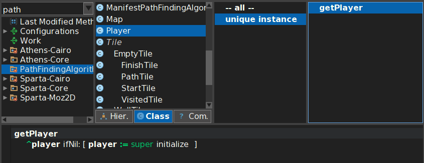

Miniworld to learn path finding algorithms
==========================================

Description: 
------------
This project was created in order to help people that love old arcade game. 
It does not mean that without this application you would not be able to play your favourite game, but it will allow you to compare different strategy how to win current level of the game and give you some knowledge about how to use path finding algorithms in real life. 

Enjoy testing effectivity of selected paths in game levels and comparing multiple algorithms that will offer you a way how to win.

The player can choose of prepared algirithms such as DFS, BFS or A-Star or you can easily implement you own and extend functionality.

Usage:
------------
Imagine that you are going to play your favourite arcade game for example old zelda.
You have been playing this game for a while, but now you have switched into hardcore mode and you got stuck.

Now is the time to change a strategy. Your previous strategy was not effective enough so you have decided to test possible algorithms to solve this problem. 
And now its time for Pharo Miniworld to learn path finding algorithms. 
Now you have to do just a few easy steps. 
    Firstly extract or rewrite into proper format map of the game.
    Then open Pharo application and watch. 
    
This application will not just show you possible ways how to win your game, but also will teach you few graph algorithms without pain. 
Then You can choose the best solution and apply it on your game. And you have won this level, so next is comming.

Now its your turn to try!!


Installation:
------------

In order to Install this application, you should firstly install Pharo.

Download the latest version of Pharo 

> http://pharo.org

Make sure that you have some program to prepare input for program. Here are some reccomended.

> https://www.sublimetext.com

> https://wiki.gnome.org/Apps/Gedit

> https://notepad-plus-plus.org

Run your Pharo application.
In ```Iceberg``` select option clone repository.

> ``` java 
https://gitlab.fit.cvut.cz/kodrmare/OOP.git 
```

Search in your browser for  ``` PathFindingAlgorithms ``` 

Now is Miniworld to learn path finding algorithms part of your Pharo.

You are ready to use it.


Basic architecture:
------------
We have decided to design this application according this diagram. 
We believe that this is a proper way how to develop easily extendable application and this design will serve its purpose.Inline-style: 


Design patters:
---------------
    
* Polymorfism

> ``` smalltalk
Object subclass: #Tile
	instanceVariableNames: ''
	classVariableNames: ''
	package: 'PathFindingAlgorithms' 
``` 


> ``` smalltalk
Tile subclass: #EmptyTile
	instanceVariableNames: 'visited'
	classVariableNames: ''
	package: 'PathFindingAlgorithms'
``` 	
	
> ``` smalltalk
EmptyTile subclass: #StartTile
	instanceVariableNames: ''
	classVariableNames: ''
	package: 'PathFindingAlgorithms'
``` 


* Null object pattern


* Double-dispatch

> ``` smalltalk
    setVisited: aGrid
	| myVisitedTile index  map|
	myVisitedTile := FinishTile new.
	map := aGrid   getMap .
	index := map childIndexOf:  self.
		map removeChildAt:  index ;
		addChild: myVisitedTile at: index.
		


* Singleton



Link and resources:
------------
https://pharo.org

http://books.pharo.org

http://rmod-pharo-mooc.lille.inria.fr/MOOC/

http://forum.world.st

http://pharo.org/news/Pharo-Video-Tutorial
