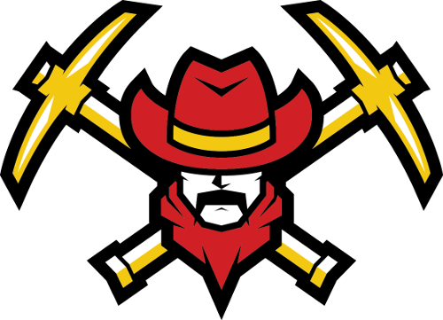

# Miner using Bloc
Sensical project for pointful subject called rationally Object Oriented Programming.



## Introduction
 "We need more minerals!" but how to get them? That's where you and your mining machine come to play.
 Submerge into soil and mine out every valuable thing residing there. Don't worry, you will be paid handsomely.
 Go deeper for more value, there's no danger to it, ...or is there?

## Install Game

### Install Pharo 6.1
[Pharo](http://pharo.org/download)

### Install Bloc
```smalltalk
Metacello new
   baseline: 'Bloc';
   repository: 'github://pharo-graphics/Bloc:pharo6.1/src';
   load: #core
```

### Clone this repository
Use iceberg to clone this repository and load all packages.

## Run Game

### The simplest method
```smalltalk
MGView new.
```

### With own map

```smalltalk
| game |
game := MinerGame load: 'mapfile.sav'.
game start.
MGView onGame: game.
```

### Multiplayer (unfinished)
```smalltalk
game := MinerGame new.
game start.
MGView onGame: game.
game currentScene addGameObjectToGrid: 
    (MiningMachine onKeysLeft: Key a right: Key d up: Key w down Key s) at 1@1.
MGView onGame: game fromCamera:2
```

## Game design

### Features
 - Pseudo-randomly generated level (seed)
 - Ability to move freely and reshape level (by mining)
 - Mine different types of ore to sell for different prices
 - Save game to load and continue later

### Design
 Level is a grid of squares, every square contains a single block of ore, dirt, stone or air.
 Top layer is composed solely of air and represents surface.
 Player will directly control a single mining machine. There is also a beta version of multiplayer.
 If the machine is moved into a block of ore or dirt, it wil dig through mining any ore in the process.
 Mined ore is transformed into score, where each ore has different value.
 Machine is unable to dig through stone blocks.
 Moving through air is faster than mining.
 The core of the game (= game engine) can be easily adapted to a similar real-time game.
 There is a strict borderline between View and Model part of the game, thus we can simply change a View part of our game.
 We are also able to create a multiple camera views to different part of the map of the gaming world.

### Controls
 Movement (4-directional) using arrow keys (by default) or any custom keys.
 
### Code requirements
- **Polymorfismus** - Pharo-Miner::MinerObject
- **Null Object Pattern** - Pharo-Miner-Engine::KeyStateNone
- **Double-dispatch** - Pharo-Miner::MinerObject, Pharo-Miner-Engine::Shape2D
- **Visitor** - Pharo-Miner::SaveManager
- **Strategy** - Pharo-Miner-Engine::GameObject

## Links
1. **Pharo:** http://pharo.org/web/download
2. **Iceberg:** https://github.com/pharo-vcs/iceberg#for-pharo-6
3. **Bloc:** http://files.pharo.org/books-pdfs/booklet-Bloc/2017-11-09-memorygame.pdf

## Weekly reports

### Week 1. (8.11.2017-14.11.2017)
**Done:**
- Analysing Memory game demo and Bloc.
- Creating Game design document
- Creating class hierarchy

**To Do:**
- Start with proof of concept

### Week 2. (15.11.2017-21.11.2017)
**Done:**
- Start coding
- Register on Discort and contact developers of Bloc
- Implemented first idea of class hierarchy

**To Do:**
- Continue on proof of concept
- Discover event announcement of keystroke

### Week 3. (22.11.2017-28.11.2017)
**Done:**
- Create main skeleton of game engine
- Create tests for main engine parts
- Contact developers of Bloc (KeyStrokeEvent)
- Discover event announcement of keystroke

**To Do:**
- Finish engine
- Create Controller (using InputManager)
- Create basic testing graphics
- Finish proof of concept

### Week 4. (29.11.2017-5.12.2017)
**Done:**
- Get engine to usable state
- Create Controller (using InputManager)
- Finish proof of concept

**To Do:**
- Finish Collider part of engine
- Improve Controller
- Create MinerLevel class
- Think of class capable of generating the level
    (randomly and from file with the same interface)

### Week 5. (6.12.2017-12.12.2017)
**Done:**
- Collider part of engine
- Improve InputManager
- Correct relaying messages (now done by announcements)

**To Do:**
- Improve Controller
- Create Scene subclasses
- Test engine
- Finish engine

### Week 6. (13.12.2017-19.12.2017)
**Done:**
- Test Collider part of engine (it failed miserably)
- Fix Collider part of engine (to work sufficiently)
- Prepare Game loop improvements (already tested)
- Create GridScene subclass of Scene (but not implemented it yet)

**To Do:**
- Start working on game specific classes (MiningMachine, Tiles, ...)
- Replace current game loop with prepared improvements (make it more fool proof)
- Add TextRenderer and Camera behaviours into engine
- Get help (how it is done correctly) with pulse synchronised input management

### Week 7. (20.12.2017-26.12.2017)
**Done:**
- Replace current game loop with prepared improvements (make it more fool proof)
- Correct input KeyState management
- Added option of passive Behaviours

**To Do:**
- Start working on game specific classes (MiningMachine, Tiles, ...)
- Add TextRenderer and Camera behaviours into engine
- Refine announcements

### Week 8. (27.12.2017-2.1.2018)
**Done:**
- Add Camera behaviour into engine
- Refine announcements
- Implement Tiles, MinerLevel, MinerGame and core of MiningMachine
- Add save/load function
- Generalize View layer

**To Do:**
- Finish MiningMachine
- Finish engine tests
- Make tests of miner game specific classes

### Week 9. (3.1.2018-4.1.2018)
**Done"**
- Add tests for rendering, engine
- Add basic MiningMachine with drill
- Finish documentation and write simple tutorial how to install and run game

**To do:**
- Successfully pass the submission
- Have second thoughts about what we could upgrade in the future

