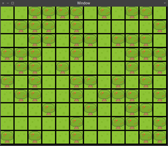
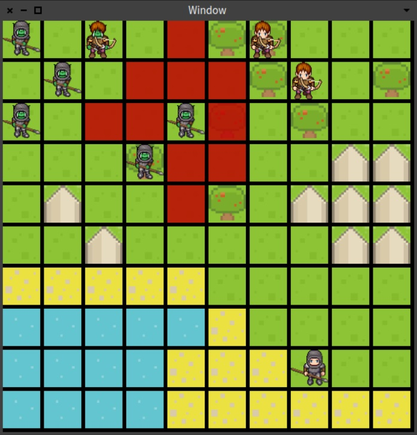

REPORTS:

7.11. - 14.11.

- Game design analyzation
- Searching for textures
- Studying materials related to AI and UI in Pharo: https://drive.google.com/drive/u/1/folders/12CPAArhQK1hEqmut8Uu_c-Ah6r6b2i1M
- tried to create just a basic board for the game. Having an issue with hashing and sets.

15.11. - 21.11.

- fixing bugs in Square class
- Finished material on Pharo Bloc (Building a memory game with Bloc).

22.11. - 28.11.
- discussing patterns of implementation
- discussing attacks, unittypes, unit representation and terrain types

29.11. - 5.12
- fixing the board and square code
- adding new classes: Bar (health and experience), Attack (melee and ranged), Unit
- implementing the Bar class just a little bit deeper
- creation of another branche drawing dedicated to drawing the board with Bloc + Initial commit that displays a window and tries to draw mock board tiles

6.12. - 12.12
- Unit and UnitTypes created. 
- Window is adjusted to given board size
- Creation of obsticles on board
- Textures + Graphic parth that displays board according to user's prefferences

Example can be run by executing: GameElement runWidth: 12 height: 10 obsticlePercentage: 50.

13.12. - 19.12
- MapLoading discussed and drafted
- We have serious talk about our development speed (too lazy). Therefore we try specifically assign tasks to specific membres of team. (Ivan - GameLogic/GameGraphics, Anezka - AI, Martin - loading from file, Tomas - GameGraphics, Honza - little bit of everything)
- Creating of main idea of game design and game flow. Talking about in which way players should make turn in order to use polymorfism and avoid "if statements"
- Implementing DFS algorithm to tell which squares (= GameTiles... some classes needs to rename) can unit move. It required some changes in classes such as  squares (=GameTiles) have to posses "pointer" to class GameBoard in order to tell their adjacent squares (=GameTiles) for pleasant implementation of DFS.
- Result of DFS will be used in Bloc to highlight squares, so that player see which way it can move. BFS algorithm will be probably needed as well for animating path to chosen square. However computing path twice (one in DFS and one in BFS seems ineffective and not so elegant).
 
20.12 - 26.12
- Working on main game flow (in class GameRPG) where 2 human players (not AI) can make turns by clicking on GameBoard. It required clickEventListener for every individual GameTile and create Player class with PlayerHuman and PlayerAI subclasses. One game turn consists of 2 moves: moving with unit and attacking with unit. If there is no option or player doesnt wanna make move, he simply clicks on his own unit for next turn. Yet no attack on units is made, only moving units has been implemented so far. Changing GameBoard can be seen in Transcript by calling method printOnTranscript on gameBoard which is using as tool for testing before we can properly and fully use Bloc graphics. There are some difference of opinion with game design and that GameRPG class doesnt follow our game design suggestions.
Computations for "where units can move?" "where units can attack" "is able unit move" are implemented in GameBoard class. For computing reachable squares where unit can move, we use DFS algorithm for its simplicity and no need of Queue. However there are some minor issues with bad counting in specific situations caused probably by a fact that every unit can have different 'costMove' at different terrains. For example unitSoldier can make move by 4 tiles. However if he goes through sand or tree, he can move only by 2 tiles, so number of moves depends on type of unit and terrain.

27.12. - 4.1
- Replacing GameRPG by Game class. GameRPG used different game design which wasnt fully approved. In GameRPG players make turns by notifications. Players has access to gameBoard via instance variable so player could make moves by accessing gameBoard methods. There were 2 methods moveByClick and moveWithoutClick. MoveByClick was used for PlayerHuman and moveWithoutClick was used for PlayerAI. PlayerHuman class provided both methods implemented further in subclasses.
Game class already supports moving and attacking with units. We were also be able to "connect" it with Bloc graphics/animation with Tomas's help. Game is fully independent from graphics. For drawing we only need game board data which we provide in GameBoard class.
The problem with bad counting unit moves was eventually cause by DFS algorithm. We have to replace it by BFS which now compute value correctly. There was also a bug which produce situation where every unit has the same move cost on terrain. So with that bug didnt matter if we move with Soldier or Archer or whatever, they could travel the same distance.
Minor issues with graphics such as white background behind units images, badly highlighting reachable squares which cover whole image of terrain, after removing unit it still somehow stay in graphic board (it was invisible but we was still able to click on it).

Example of a game state: GameElement runWidth: 12 height: 10 obsticlePercentage: 50.

- Game can be executed from class Game -  example

We implement this objective patterns:

- polymorphism - in Player
- null object pattern - UnitMasterClass - notUnit and Unit to avoid null
- observer - notifications for graphics
- singleton - Game class